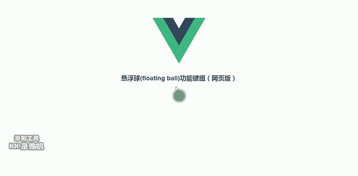
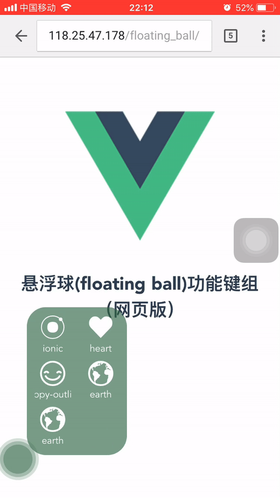

# vue-floating-ball

> A vue plug for showing floating ball. Because of using fonticon, so you must import any you like Fonticon library by yourself before using it. or there will be a problem that icon do not display normally. By the way, themeColor, initPosition and popoverEvents Props can dynamic change. 

[LiveDemo](http://118.25.47.178/floatingBall/)

### Screenshots
###1. PC

###2. mobile


### install

By npm or yarn
```
npm install vue-floating-ball@latest -S

yarn add vue-floating-ball@latest
```
By CDN
```
<script src='vue-floating-ball.min.js'>
```

### Usage

Register component globally

```
// main.js
import Vue from 'vue'
import App from './App'
import VueFloatingBall from 'vue-floating-ball'
import 'ionicons/dist/css/ionicons.min.css'

Vue.config.productionTip = false
Vue.use(VueFloatingBall)

new Vue({
  el: '#app',
  template: '<App/>',
  components: { App }
})

// App.vue
<template>
  <div id="app">
    <floating-ball :theme-color="themeColor" :init-position="initPosition" :popover-events="popoverEvents"></floating-ball>
  </div>
</template>

<script>

export default {
  name: 'App',
  data () {
    return {
      themeColor: '#316745',
      initPosition: 'top left',
      popoverEvents: [
        { parentName: 'App', eventName: 'show-data-airplane', iconName: 'ion ion-ios-airplane', showName: 'airplane' },
        { parentName: 'App', eventName: 'show-data-football', iconName: 'ion ion-ios-american-football', showName: 'football' },
        { parentName: 'App', eventName: 'show-data-appstore', iconName: 'ion ion-ios-appstore', showName: 'appstore' },
        { parentName: 'App', eventName: 'show-data-github', iconName: 'ion ion-logo-github', showName: 'github' },
        { parentName: 'App', eventName: 'show-data-css3', iconName: 'ion ion-logo-css3', showName: 'css3' },
        { parentName: 'App', eventName: 'show-data-html5', iconName: 'ion ion-logo-html5', showName: 'html5' }]
    }
  },
  created () {
    this.$on('show-data-add', this.ShowDataAdd)
    this.$on('show-data-heart', this.ShowDataHeart)
    this.$on('show-data-airplane', this.ShowDataAirplane)
    this.$on('show-data-football', this.ShowDataFootball)
    this.$on('show-data-appstore', this.ShowDataAppstore)
    this.$on('show-data-github', this.ShowDataGithub)
  },
  methods: {
    ShowDataAdd () {
      alert('点击了Add图标')
    },
    ShowDataHeart () {
      alert('点击了Heart图')
    },
    ShowDataAirplane () {
      alert('点击了Airplane图标')
    },
    ShowDataFootball () {
      alert('点击了Football图标')
    },
    ShowDataAppstore () {
      alert('点击了Appstore图标')
    },
    ShowDataGithub () {
      alert('点击了Github图标')
    }
  }
}
</script>

<style scoped>
#app {
  text-align: center;
  color: #2c3e50;
  margin-top: 30px;
}
</style>

```

or register locally in your `.vue` file

CDN example
```
<!DOCTYPE html>
<html>
<head>
    <meta charset="utf-8">
    <meta name="viewport" content="width=device-width,initial-scale=1">
    <title>vue-floating-ball</title>
    <link href="https://unpkg.com/ionicons@4.1.2/dist/css/ionicons.min.css" rel="stylesheet">
    <style type="text/css">
      #app {
        text-align: center;
        color: #2c3e50;
        margin-top: 30px;
      }
    </style>
</head>

<body>
    <div id="app">
      <floating-ball
        :theme-color="themeColor"
        :init-position="initPosition"
        :popover-events="popoverEvents">
    </floating-ball>
    </div>
    <script src="https://unpkg.com/vue/dist/vue.js"></script>
    <script type="text/javascript" src="./js/vue-floating-ball.min.js"></script>
    <script>
        new Vue({
          el: '#app',
          name: 'App',
          data() {
            return {
              themeColor: '#595857',
              initPosition: 'top left',
              popoverEvents: [
                { parentName: 'App', eventName: 'show-data-airplane', iconName: 'ion ion-ios-airplane', showName: 'airplane' },
                { parentName: 'App', eventName: 'show-data-football', iconName: 'ion ion-ios-american-football', showName: 'football' },
                { parentName: 'App', eventName: 'show-data-appstore', iconName: 'ion ion-ios-appstore', showName: 'appstore' },
                { parentName: 'App', eventName: 'show-data-github', iconName: 'ion ion-logo-github', showName: 'github' },
                { parentName: 'App', eventName: 'show-data-css3', iconName: 'ion ion-logo-css3', showName: 'css3' },
                { parentName: 'App', eventName: 'show-data-html5', iconName: 'ion ion-logo-html5', showName: 'html5' }]
            }
          },
          created () {
            this.$on('show-data-add', this.ShowDataAdd)
            this.$on('show-data-heart', this.ShowDataHeart)
            this.$on('show-data-airplane', this.ShowDataAirplane)
            this.$on('show-data-football', this.ShowDataFootball)
            this.$on('show-data-appstore', this.ShowDataAppstore)
            this.$on('show-data-github', this.ShowDataGithub)
          },
          methods: {
            ShowDataAdd () {
              alert('点击了Add图标')
            },
            ShowDataHeart () {
              alert('点击了Heart图')
            },
            ShowDataAirplane () {
              alert('点击了Airplane图标')
            },
            ShowDataFootball () {
              alert('点击了Football图标')
            },
            ShowDataAppstore () {
              alert('点击了Appstore图标')
            },
            ShowDataGithub () {
              alert('点击了Github图标')
            }
          } 
        })
    </script>
</body>
</html>
```

### Docs

#### props

| Name        | Description           | Type           | default |
| -------------|:-------------:|:-------------:| -----:|
| themeColor     | set floating-ball primary color | String | #adadad |
| initPosition      | set floating-ball init position.(top/bottom/left/right) | string | bottom right |
| popoverEvents      | events will be displayed on the floating-ball popover | Array | [] |


#### popoverEvents props

| Name        | Description           | Type           | default |
| -------------|:-------------:|:-------------:| -----:|
| parentName     | parent component name | string | - |
| eventName      | event name | String | - |
| iconName     | icon name (eg:[ionicons](http://ionicons.com/)) | string | - |
| showName      | word name | String | - |

```
// example
<script>
export default {
  name: 'App',
  data () {
    return {
      themeColor: '#316745',
      initPosition: 'top left',
      popoverEvents: [
        { parentName: 'App', eventName: 'show-data-airplane', iconName: 'ion ion-ios-airplane', showName: 'airplane' },
        { parentName: 'App', eventName: 'show-data-football', iconName: 'ion ion-ios-american-football', showName: 'football' },
        { parentName: 'App', eventName: 'show-data-appstore', iconName: 'ion ion-ios-appstore', showName: 'appstore' },
        { parentName: 'App', eventName: 'show-data-github', iconName: 'ion ion-logo-github', showName: 'github' },
        { parentName: 'App', eventName: 'show-data-css3', iconName: 'ion ion-logo-css3', showName: 'css3' },
        { parentName: 'App', eventName: 'show-data-html5', iconName: 'ion ion-logo-html5', showName: 'html5' }]
    }
  },
  created () {
    this.$on('show-data-add', this.ShowDataAdd)
    this.$on('show-data-heart', this.ShowDataHeart)
    this.$on('show-data-airplane', this.ShowDataAirplane)
    this.$on('show-data-football', this.ShowDataFootball)
    this.$on('show-data-appstore', this.ShowDataAppstore)
    this.$on('show-data-github', this.ShowDataGithub)
  },
  methods: {
    ShowDataAdd () {
      alert('点击了Add图标')
    },
    ShowDataHeart () {
      alert('点击了Heart图')
    },
    ShowDataAirplane () {
      alert('点击了Airplane图标')
    },
    ShowDataFootball () {
      alert('点击了Football图标')
    },
    ShowDataAppstore () {
      alert('点击了Appstore图标')
    },
    ShowDataGithub () {
      alert('点击了Github图标')
    }
  }
}
</script>
```


